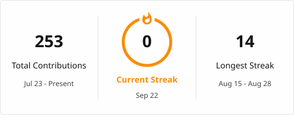

# Hi there, I'm Alina 

BS Cyber Security @ SMIU.  
Focused on application security, networks, and cloud-native systems.

###  $ status --current
```bash
> Shifting from C/C++ to Go
> Learning Linux internals, Docker, and container security
> Prep for CNCF LFX Mentorship (Term 3)
```


###  Tech Stack & Tools

 

---


###  GitHub Stats & Streak
<a href="https://git.io/streak-stats"></a>

---

###  GitHub Trophies
 https://github-profile-trophy.vercel.app/?username=alina-cloudsec&theme=darkhub&no-frame=true&row=1&column=6

---

###  Random Dev Quote


 
---

##  Socials:
 alinamoin217@gmail.com

---

##  Certificates:
 ### Certified Meshery Contributor (CMC) — Meshery CLI
 Passed the official Meshery CLI assessment, demonstrating hands-on understanding of `mesheryctl` architecture, command structure, and the open-source contribution workflow.
 [View Result](https://github.com/alina-cloudsec/alina-cloudsec/blob/main/cmc_result.png)
 
 ### LFC102: Inclusive Open Source Community Orientation
 Completed the Linux Foundation's course on respectful open-source collaboration, community communication norms, and documentation best practices.
 [View Credly Badge](https://www.credly.com/badges/84d87231-d184-4fca-bb5a-d60a3b972233/public_url)

---

##  Badges:

 

---

## Profile Visitor Counter
<p align="left">  </p>
 


 
 
